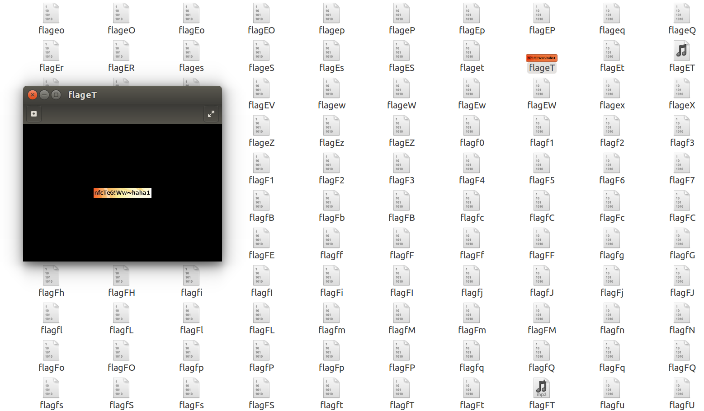

# reverse_03
## Author: Wenhuo

&nbsp;&nbsp;&nbsp;&nbsp;<font size=2>CISCN的一个比赛，那个比赛题目收集的不多，那就放这了。这题比较坑，当时比赛时候做着感觉这题目莫不是有问题，后来看了官方wp之后发现脚本都没有，密文仍然跟真正程序里的不一样，但主办方没说有问题那就这样吧，赛后复现了一下发现可真是疯狂。</font></br>
&nbsp;&nbsp;&nbsp;&nbsp;<font size=2>main函数逻辑前半部分就是用‘_’分隔字符串加密对比，三个加密函数是这个：</font></br>

```C
  if ( (unsigned int)sub_4012DE(first_string) )
    return 0xFFFFFFFFLL;
  if ( (unsigned int)sub_401411(second_string) )
    return 0xFFFFFFFFLL;
  if ( (unsigned int)sub_401562(last_string) )
    return 0xFFFFFFFFLL;
  puts("Congratulations!");
```

&nbsp;&nbsp;&nbsp;&nbsp;<font size=2>前两个比较简单，一系列操作后md5加密后与密文对比，脚本就不放了。第三个就比较坑了，md5还原出来了之后再cmd5里怎么都搜不到结果，后来发现原来的确是搜不出来的，需要爆破dump文件，坑，太坑了。</font></br>
&nbsp;&nbsp;&nbsp;&nbsp;<font size=2>脚本我就不全部放了，组成图片的数据太长，我就放爆破文件的部分：</font></br>

```C
char* dir="0123456789abcdefghijklmnopqrstuvwxyzABCDEFGHIJKLMNOPQRSTUVWXYZ%";
int main(int argc,char**argv)
{
	
	unsigned char* key=(unsigned char*)malloc(0x1560);
	unsigned char*ptr=key_flag;
	int i,k;
	
	for(i=0;i<0x155A;i++)
	{
		key[i]=*ptr;
		ptr++;
	}
	unsigned int sum=0x64f;
	char filename[10]={0,};
	gets(filename);
    unsigned char n1,n2;
	
	int a=0;
	int b=0;
	int n;
	FILE* f;
	while(1)
	{
		ptr=key_flag;
		for(i=0;i<0x155A;i++)
		{
			key[i]=*ptr;
			ptr++;
		}
		n1=dir[a];
		n2=dir[b];
		n=(dir[a]<<8)+dir[b];
		filename[4]=n1;
		filename[5]=n2;
		
		f=fopen((const char*)filename,"w+");
		i=0;
		do{
		    if(i&1)
			    key[i]^=n1^(sum&0xf);
		    else
			    key[i]^=n2^(sum>>4);
		    ++i;
	      }while(i!=0x1558);
	    fwrite(key,0x1558,1,f);
	    fclose(f);
	    printf("%x\n",n);
        ++b;
		if(b==62)
		{
			b=0;
			a++;
		}
		if(a==62)
			exit(0);
    }
	return 0;
	
}

```

&nbsp;&nbsp;&nbsp;&nbsp;<font size=2>然后生成了无数个文件，注意要在Linux下再跑，这样Linux可以自己识别出哪个是图片，然后找了一下还真有一个flag图片，是个狼人：)</font></br>

