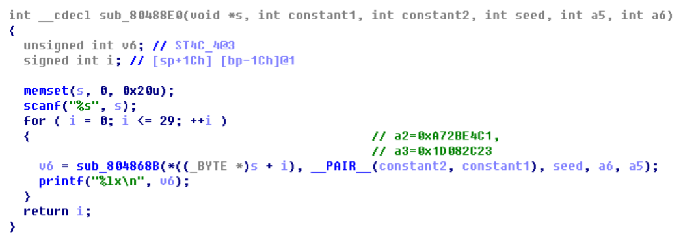
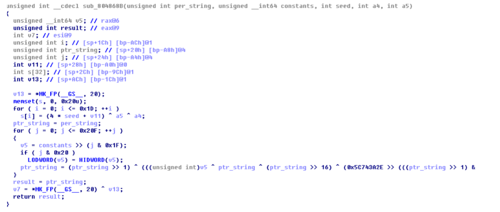

# babyre
## Author: fanda

&nbsp;&nbsp;&nbsp;&nbsp;这道题很迷,看了几个函数感觉莫名其妙的，还傻傻的去逆了会儿 srand 和 rand 函数。   后来发现其实关键函数就一个。  

    

&nbsp;&nbsp;&nbsp;&nbsp;中间这个函数跟我们的输入有关，跟进去看看：     
</br>

</br>
&nbsp;&nbsp;&nbsp;&nbsp;这里又要求我们输入一个字符串，猜测这循环里面的函数是逐个对我们输入的字节进行加 密，并且把最开始传进来的两个立即数合并了。   
</br>

</br>
&nbsp;&nbsp;&nbsp;&nbsp;所以加密函数就是这一个了。考虑到是逐个加密，所以直接爆破就行了。 题目给了我们一个 out 文件，这里面的数据应该就是要复现的密文了，所以我写了以下脚本 爆破：    
</br>

脚本
-------
</br>

``` C++
#define LODWORD(x)  (*((unsigned int*)&(x))) 
#define HIDWORD(x)  (*((unsigned int*)&(x)+1)) 
 
unsigned __int64 key[]={     
0x70573EFEB80C91FE,    
0x7F7A8193BEED92AE,     
0x90347C6C7390C17B,    
0xAA7A15DFAA7A15DF,    
0x153F1A32526BA076,    
0x7D8AA463545C15AD,     
0xFBCB7AA0526BA076,    
0x9C5132667D8AA463,     
0x6D7DF3E1526BA076,     
0x9C513266AA7A15DF,     
0x9323BC071EDC3864,    
0xFBCB7AA07D8AA463,     
0x526BA076153F1A32,    
0xAA7A15DFF5650025,    
0xB13AD8881EDC3864,    
0 }; 
 
int main()    
{     
  unsigned int ptr_string;   
  unsigned __int64 constants=0x1d082c23a72be4c1;  
  unsigned __int64 temp;    
  int i=0;    
  unsigned int* ptr_key=(unsigned int*)key;   
  char* dir="0123456789abcdefghijklmnopqrstuvwxyzABCDEFGHIJKLMNOPQRSTUVWXYZ";    
  while(1)   
  {  
    i=0;   
    while(1)    
    {   
      ptr_string=dir[i];    
      for (int j = 0; j <= 0x20F; ++j)     
      {      
        temp = constants >> (j & 0x1F);      
        if ( j & 0x20 )       
        LODWORD(temp) = HIDWORD(temp);      
        ptr_string = (ptr_string >> 1) ^ (((unsigned int)temp ^ ptr_string ^ (ptr_string >> 16) ^ (0x5C743A2E >> (((ptr_string >> 1) & 1) + 2 * (2 * (((ptr_string >> 20) & 1) + 2 * (2 * (ptr_string >> 31) + ((ptr_string >> 26) & 1))) + ((ptr_string >> 9) & 1))))) << 31);    
      }     
      if(ptr_string==*ptr_key)     
        break;    
      i++; 
    }   
    printf("%c",dir[i]);   
    ptr_key++;   
    if(!(*ptr_key))   
      break;  
    }  
  return 0;   
  }
```   
瞬间得到flag :)
</br>


 
