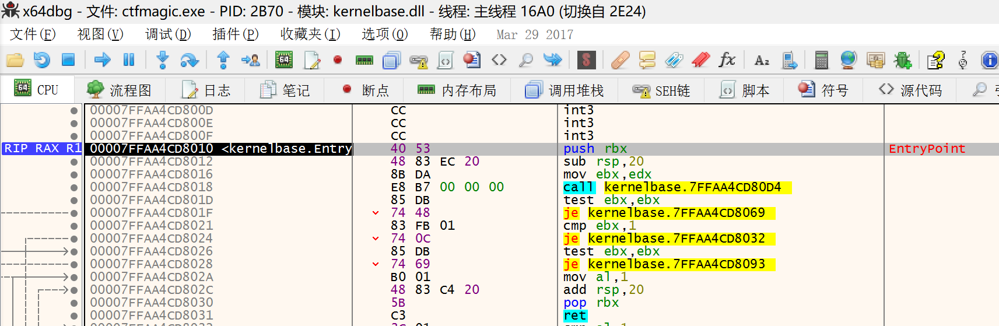
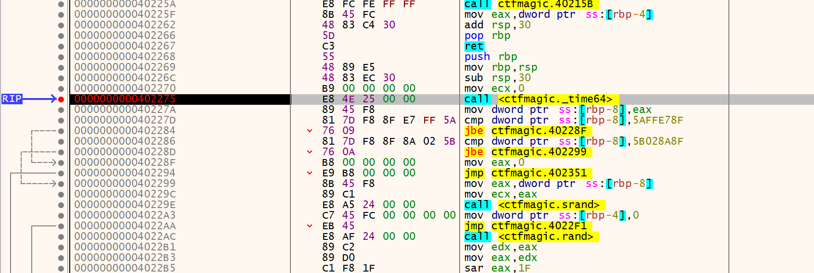
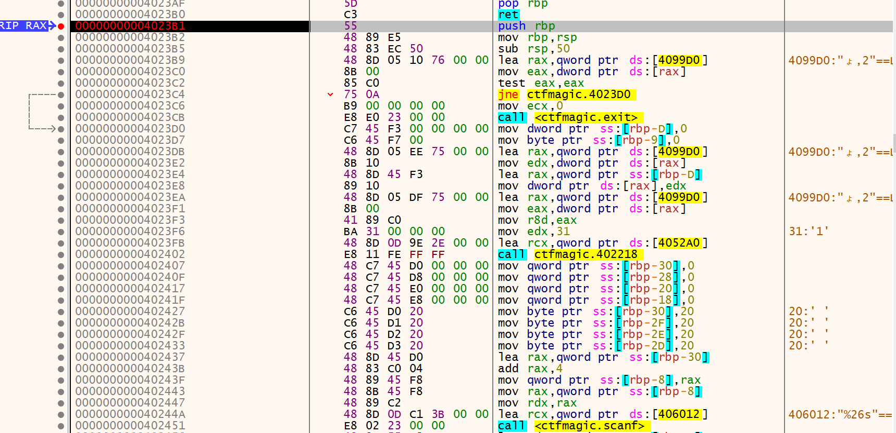
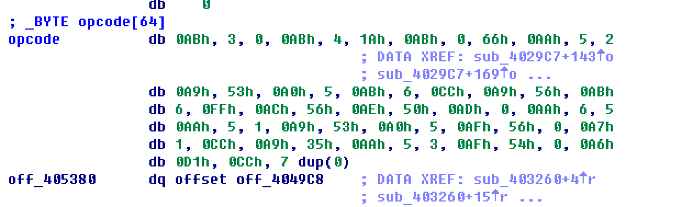
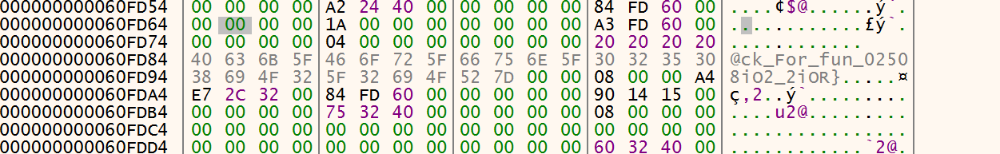
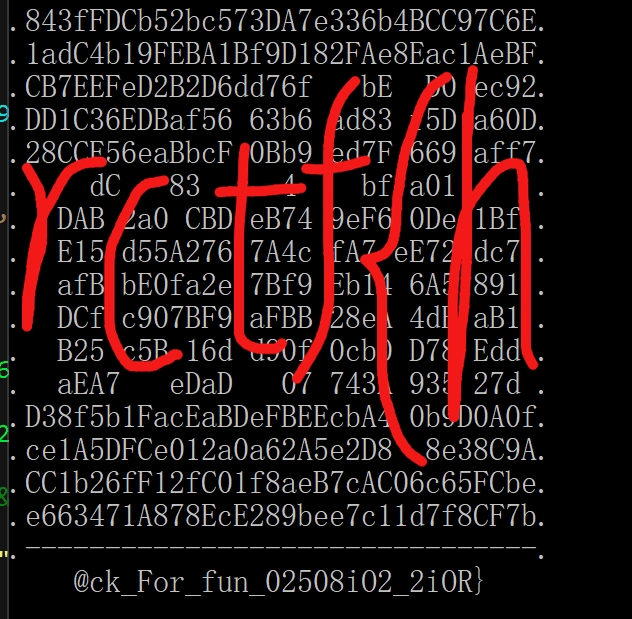

# RCTF magic
## Author: Wenhuo
</br>
</br>

>整就牛！不管这有多困难，相信你的资质:)

</br>

&nbsp;&nbsp;&nbsp;&nbsp;<font size=2>这道题下下来发现是一个exe，好久没做win下的题目了，gdb用多了突然有点用不惯窗口化的调试工具。。。但是窗口化工具也有窗口化的好处，呈现的信息更多，我还是比较喜欢做win下的题目的，感觉一般来说题目更难挑战也更大:P  </font></br>
&nbsp;&nbsp;&nbsp;&nbsp;<font size=2>动态调试工具我用的x64dbg，配合IDA。好了，开始撸这题吧！</font></br>



&nbsp;&nbsp;&nbsp;&nbsp;<font size=2>一开始搜索字符串看到sub_402563这个函数，虽然感觉这题也不太可能这么简单，跑了一下，然后给了我“a_joke:p”，好了，太秀了。上x64dbg,看看flag到底怎么搞得。</font></br>
&nbsp;&nbsp;&nbsp;&nbsp;<font size=2>发现怎么都跟踪不到上面那个函数，诶？难道是TLS？petool分析一波，找到tls table到里面看了一下没看懂:)，行，那我们单步跟踪，直接F8每次步过，同时关注被调试窗口的输出，如果输出了字符串，下断，重新跑，然后跟进这个函数，再重复上述，直到跟踪到这里（为什么是这里？因为这里是time函数，提示信息不是说时间不对吗:)</font></br>



&nbsp;&nbsp;&nbsp;&nbsp;<font size=2>用IDA转到这个地址看一下这里是什么操作：</font></br>

```C
__int64 sub_402268()
{
  __int64 result; // rax@3
  unsigned int v1; // [sp+20h] [bp-10h]@7
  int v2; // [sp+24h] [bp-Ch]@7
  unsigned int Seed; // [sp+28h] [bp-8h]@1
  int i; // [sp+2Ch] [bp-4h]@4

  Seed = time64(0i64);
  if ( Seed > 0x5AFFE78F && Seed <= 0x5B028A8F )
  {
    srand(Seed);
    for ( i = 0; i <= 255; ++i )
      key1_table[i] ^= rand();
    v2 = 0;
    v1 = 0;
    sub_4027ED((__int64)key1_table, &v2, &v1);
    if ( v2 == 0x700 )
    {
      failed_flag[0] = v1;
      result = v1;
    }
    else
    {
      failed_flag[0] = 0;
      result = 0i64;
    }
  }
  else
  {
    result = 0i64;
  }
  return result;
}
```

&nbsp;&nbsp;&nbsp;&nbsp;<font size=2>这里用这个time做种子，然后rand生成256个数据对内存里的密文进行异或操作，然后看看这里面的一个自定义函数：</font></br>

```C
_DWORD *__fastcall sub_4027ED(__int64 key, _DWORD *a2, _DWORD *a3)
{
  _DWORD *result; // rax@4
  char Dst; // [sp+20h] [bp-60h]@1
  int v5; // [sp+C18h] [bp+B98h]@4
  int v6; // [sp+C1Ch] [bp+B9Ch]@4
  unsigned int i; // [sp+C2Ch] [bp+BACh]@1
  char vars0[8]; // [sp+C30h] [bp+BB0h]@2
  __int64 ptr_key; // [sp+C40h] [bp+BC0h]@1
  _DWORD *v10; // [sp+C48h] [bp+BC8h]@1
  _DWORD *v11; // [sp+C50h] [bp+BD0h]@1

  ptr_key = key;
  v10 = a2;
  v11 = a3;
  memset(&Dst, 0, 0xC00ui64);
  for ( i = 0; (signed int)i <= 255; ++i )
  {
    vars0[12 * i - 3088] = *(_BYTE *)((signed int)i + ptr_key);
    *(_DWORD *)&vars0[12 * i - 3084] = 0x7FFFFFFF;
    *(_DWORD *)&vars0[12 * i - 3080] = 0;
    sub_4026D0((__int64)&Dst, i);
  }
  *v10 = v5;                                    // v5 should be 0x700
  result = v11;
  *v11 = v6;
  return result;
}
```

&nbsp;&nbsp;&nbsp;&nbsp;<font size=2>这里初始化了一个结构体，其中有三个成员，这个结构体看起来应该是这样的：</font></br>

```C
struct var{
  BYTE key;
  DWORD mem1;
  DWORD mem2;
}
```

&nbsp;&nbsp;&nbsp;&nbsp;<font size=2>初始化的时候key被初始化为之前异或后的密文，然后其他两个成员始终都被赋值为0x7FFFFFFF和0，紧随其后又是一个自定义函数，继续跟进分析：</font></br>

```C
signed __int64 __fastcall sub_4026D0(__int64 t_struct, unsigned int index)
{
  signed __int64 result; // rax@1
  signed __int64 v3; // rax@3
  int v4; // [sp+24h] [bp-1Ch]@14
  signed __int64 v5; // [sp+28h] [bp-18h]@8
  signed __int64 v6; // [sp+30h] [bp-10h]@5
  signed __int64 v7; // [sp+38h] [bp-8h]@1
  __int64 struct_ptr; // [sp+50h] [bp+10h]@1
  unsigned int _index; // [sp+58h] [bp+18h]@1

  struct_ptr = t_struct;
  _index = index;
  result = safe_get_struct(t_struct, index);
  v7 = result;
  if ( result )
  {
    if ( _index & 0xF )
      v3 = safe_get_struct(struct_ptr, _index - 1);
    else
      v3 = 0i64;
    v6 = v3;
    if ( _index + 15 <= 0x1E )
      result = 0i64;
    else
      result = safe_get_struct(struct_ptr, _index - 16);
    v5 = result;
    if ( v6 || result )
    {
      if ( v6 )
      {
        *(_DWORD *)(v7 + 4) = *(_BYTE *)v7 + *(_DWORD *)(v6 + 4);
        result = v7;
        *(_DWORD *)(v7 + 8) = 2 * *(_DWORD *)(v6 + 8);
      }
      if ( v5 )
      {
        v4 = *(_DWORD *)(v5 + 4) + *(_BYTE *)v7;
        result = *(_DWORD *)(v7 + 4);
        if ( v4 < (signed int)result )
        {
          *(_DWORD *)(v7 + 4) = v4;
          result = v7;
          *(_DWORD *)(v7 + 8) = 2 * *(_DWORD *)(v5 + 8) | 1;
        }
      }
    }
    else
    {
      result = v7;
      *(_DWORD *)(v7 + 4) = *(_BYTE *)v7;
    }
  }
  return result;
}
```

&nbsp;&nbsp;&nbsp;&nbsp;<font size=2>发现这个函数还是有些繁杂的，它对传进来的结构的成员进行了一些运算加工，然后这里面还有的一个自定义我已经命名了，顾名思义，判断是否在区间里:D并不重要。</font></br>
&nbsp;&nbsp;&nbsp;&nbsp;<font size=2>当循环结束的时候会对其中一个成员（事实上是struct[255].mem1）进行判断是否0x700，如果不是的话就报错退出，那么肯定有一个seed可以让他等于0x700，所以我们要通过爆破（没错又是爆破）得到这个seed到底是多少，所以爆破脚本如下：</font></br>

脚本
=======
```C
#include <stdio.h>

unsigned char key_table[]={
  0x58, 0x71, 0x8F, 0x32, 0x05, 0x06, 0x51, 0xC7, 
  0xA7, 0xF8, 0x3A, 0xE1, 0x06, 0x48, 0x82, 0x09, 
  0xA1, 0x12, 0x9F, 0x7C, 0xB8, 0x2A, 0x6F, 0x95, 
  0xFD, 0xD0, 0x67, 0xC8, 0xE3, 0xCE, 0xAB, 0x12, 
  0x1F, 0x98, 0x6B, 0x14, 0xEA, 0x89, 0x90, 0x21, 
  0x2D, 0xFD, 0x9A, 0xBB, 0x47, 0xCC, 0xEA, 0x9C, 
  0xD7, 0x50, 0x27, 0xAF, 0xB9, 0x77, 0xDF, 0xC5,
  0xE9, 0xE1, 0x50, 0xD3, 0x38, 0x89, 0xEF, 0x2D,
  0x72, 0xC2, 0xDF, 0xF3, 0x7D, 0x7D, 0x65, 0x95, 
  0xED, 0x13, 0x00, 0x1C, 0xA3, 0x3C, 0xE3, 0x57, 
  0xE3, 0xF7, 0xF7, 0x2C, 0x73, 0x88, 0x34, 0xB1, 
  0x62, 0xD3, 0x37, 0x19, 0x26, 0xBE, 0xB2, 0x33, 
  0x20, 0x3F, 0x60, 0x39, 0x87, 0xA6, 0x65, 0xAD, 
  0x73, 0x1A, 0x6D, 0x49, 0x33, 0x49, 0xC0, 0x56, 
  0x00, 0xBE, 0x0A, 0xCF, 0x28, 0x7E, 0x8E, 0x69, 
  0x87, 0xE1, 0x05, 0x88, 0xDA, 0x54, 0x3E, 0x3C, 
  0x0E, 0xA9, 0xFA, 0xD7, 0x7F, 0x4E, 0x44, 0xC6, 
  0x9A, 0x0A, 0xD2, 0x98, 0x6A, 0xA4, 0x19, 0x6D, 
  0x8C, 0xE1, 0xF9, 0x30, 0xE5, 0xFF, 0x33, 0x4A, 
  0xA9, 0x52, 0x3A, 0x0D, 0x67, 0x20, 0x1D, 0xBF, 
  0x36, 0x3E, 0xE8, 0x56, 0xBF, 0x5A, 0x88, 0xA8, 
  0x69, 0xD6, 0xAB, 0x52, 0xF1, 0x14, 0xF2, 0xD7, 
  0xEF, 0x92, 0xF7, 0xA0, 0x70, 0xA1, 0xEF, 0xE3, 
  0x1F, 0x66, 0x2B, 0x97, 0xF6, 0x2B, 0x30, 0x0F, 
  0xB0, 0xB4, 0xC0, 0xFE, 0xA6, 0x62, 0xFD, 0xE6, 
  0x4C, 0x39, 0xCF, 0x20, 0xB3, 0x10, 0x60, 0x9F, 
  0x34, 0xBE, 0xB2, 0x1C, 0x3B, 0x6B, 0x1D, 0xDF, 
  0x53, 0x72, 0xF2, 0xFA, 0xB1, 0x51, 0x82, 0x04, 
  0x30, 0x56, 0x1F, 0x37, 0x72, 0x7A, 0x97, 0x50, 
  0x29, 0x86, 0x4A, 0x09, 0x3C, 0x59, 0xC4, 0x41, 
  0x71, 0xF8, 0x1A, 0xD2, 0x30, 0x88, 0x63, 0xFF, 
  0x85, 0xDE, 0x24, 0x8C, 0xC3, 0x37, 0x14, 0xC7};

typedef struct struct1
{
	char k;
	int n;
	int none;
}Struct;

Struct*  safe_get_struct(Struct* t_struct, signed int a2)
{
  Struct* result; // rax@3

  if ( a2 >= 0 && a2 <= 255 )
    result = &t_struct[a2];
  else
    memset(result,0,sizeof(result));
  return result;
}

void set_struct(Struct* Dst,int index)
{
	Struct* result; // rax@1
  Struct* v3; // rax@3
  __int64 v4; // [sp+24h] [bp-1Ch]@14
  Struct* v5; // [sp+28h] [bp-18h]@8
  Struct* v6; // [sp+30h] [bp-10h]@5
  Struct* v7; // [sp+38h] [bp-8h]@1
  Struct* struct_ptr; // [sp+50h] [bp+10h]@1
  unsigned int _index; // [sp+58h] [bp+18h]@1

   struct_ptr = Dst;
  _index = index;
  result = safe_get_struct(Dst, index);
  v7 = result;
  if ( result )
  {
    if ( _index & 0xF )
      v3 = safe_get_struct(struct_ptr, _index - 1);
    else
      v3 = 0;
    v6 = v3;
    if ( _index + 15 <= 0x1E )
      result = 0;
    else
      result = safe_get_struct(struct_ptr, _index - 16);
    v5 = result;
    if ( v6 || result )
    {
      if ( v6 )
      {
        v7->n = v7->k + v6->n;
        result = v7;
        v7->none = 2 * v6->none;
      }
      if ( v5 )
      {
        v4 = v5->n +v7->k;
        if ( v4 < (signed int)v7->n)
        {
          v7->n= v4;
          result = v7;
          v7->none = 2 * v5->none | 1;
        }
      }
    }
    else
    {
      result = v7;
      v7->n = v7->k;
    }
  }
}
bool get_res(unsigned char* key)
{
	
	Struct* Dst;
	Dst=(Struct*)malloc(256*(sizeof(Struct)));
	memset(Dst,0,0xC00);
	for (int i = 0; (signed int)i <= 255; ++i )
  {
    Dst[i].k = key[i];
    Dst[i].n = 0x7FFFFFFF;
    Dst[i].none = 0;
    set_struct(Dst, i);
  
  }
  if(Dst[255].n==0x700&&Dst[255].none!=0)
  {
  	return 1;
  }
  else
  	return 0;
}

int main()
{
	unsigned int seed=0x5AFFE78F;
	unsigned char key[256]={0,};
	while(seed<=0x5B028A8F)
	{
		srand(seed);
		memcpy(key,key_table,256);
		for(int i=0;i<=255;i++)
		{
			key[i]^=rand();
			
		}
		if(get_res(key))
		{
			printf("\nresult is:%x\n",seed);	
			break;
		}
		else
		{
		  printf("\nseed:%x",seed);
		  seed++;
	  }
	}
	
	return 0;
}
//最后得到0x5b00e398
```

&nbsp;&nbsp;&nbsp;&nbsp;<font size=2>得到了正确的seed之后，我们回到x64dbg，F8步过time64函数，然后修改rax(返回值知道吧)为0x5b00e398，继续往下执行，我们来到了一个需要我们输入的函数，猜测这里就是得到flag的关键了：</font></br>



&nbsp;&nbsp;&nbsp;&nbsp;<font size=2>同样的，用IDA转到这个位置看一下流程：</font></br>

```C
__int64 print_flag()
{
  __int64 result; // rax@4
  char Str[8]; // [sp+20h] [bp-30h]@3
  __int64 v2; // [sp+28h] [bp-28h]@3
  __int64 v3; // [sp+30h] [bp-20h]@3
  __int64 v4; // [sp+38h] [bp-18h]@3
  unsigned int v5; // [sp+43h] [bp-Dh]@3
  char v6; // [sp+47h] [bp-9h]@3
  const char *input_ptr; // [sp+48h] [bp-8h]@3

  if ( !failed_flag[0] )
    exit(0);
  v6 = 0;
  v5 = failed_flag[0];
  xor_and_puts((__int64)&unk_4052A0, 49, failed_flag[0]);
  *(_QWORD *)Str = 0i64;
  v2 = 0i64;
  v3 = 0i64;
  v4 = 0i64;
  Str[0] = 32;
  Str[1] = 32;
  Str[2] = 32;
  Str[3] = 32;
  input_ptr = &Str[4];
  scanf("%26s", &Str[4]);
  sub_401F37((__int64)input_ptr, 0x1Au, (__int64)&v5, 4u);
  if ( (unsigned int)sub_4029C7(input_ptr) )
  {
    sub_401F37((__int64)input_ptr, 0x1Au, (__int64)&v5, 4u);
    sub_401FFB();
    xor_and_puts((__int64)&unk_4052E0, 35, failed_flag[0]);
    puts(Str);
    result = xor_and_puts((__int64)&unk_4052E0, 35, failed_flag[0]);
  }
  else
  {
    result = xor_and_puts((__int64)aXc, 6, failed_flag[0]);
  }
  return result;
}
```

&nbsp;&nbsp;&nbsp;&nbsp;<font size=2>首先查看一下sub_401F37函数，其中就是一些加密，看传进去的参数应该是用key对input进行了加密，if的前后有两个这个函数，连续加密两次不太可能，毕竟后面还输出了这个“连续加工两次的input”，猜测是类似异或的可逆加密，逆逆得正:P,然后看if里的函数，这个应该就是关键的验证函数了：</font></br>

```C
__int64 __fastcall sub_4029C7(const char *string)
{
  int op_command; // eax@2
  int v2; // eax@23
  jmp_buf Buf; // [sp+20h] [bp-110h]@2
  unsigned int v5; // [sp+124h] [bp-Ch]@1
  int v6; // [sp+128h] [bp-8h]@1
  int step; // [sp+12Ch] [bp-4h]@1

  strncpy(string_buf, string, 0x1Aui64);
  signal(8, (void (__cdecl *)(int))Func);
  step = 0;
  v6 = 1;
  v5 = 0;
  key_ptr = (unsigned __int64)&key_table;
  input_ptr = (unsigned __int64)string_buf;
  while ( v6 )
  {
    op_command = setjmp(Buf);
    if ( op_command == 0xA8 )
    {
      *(&reg_addr + (unsigned __int8)(opcode[step] >> 4)) -= *(&reg_addr + (opcode[step] & 0xF));
      ++step;
    }
    else if ( op_command > 0xA8 )
    {
      if ( op_command == 0xAC )
      {
        *(&reg_addr + (unsigned __int8)(opcode[step] >> 4)) &= *(&reg_addr + (opcode[step] & 0xF));
        ++step;
      }
      else if ( op_command > 0xAC )
      {
        if ( op_command == 0xAE )
        {
          *(&reg_addr + (unsigned __int8)(opcode[step] >> 4)) ^= *(&reg_addr + (opcode[step] & 0xF));
          ++step;
        }
        else if ( op_command < 0xAE )
        {
          *(&reg_addr + opcode[step]) = (unsigned __int8)~*((_BYTE *)&reg_addr + 4 * opcode[step]);
          ++step;
        }
        else
        {
          if ( op_command != 0xAF )
            goto LABEL_43;
          dword_409060 = (unsigned __int8)(opcode[step] >> 4);
          dword_409064 = opcode[step] & 0xF;
          if ( !setjmp(::Buf) )
            opcode[step] = dword_409060 / opcode[step + 1];
          step += 2;
        }
      }
      else if ( op_command == 0xAA )
      {
        *(&reg_addr + opcode[step]) = *(&reg_addr + opcode[step + 1]);
        step += 2;
      }
      else if ( op_command > 0xAA )
      {
        *(&reg_addr + opcode[step]) = opcode[step + 1];
        step += 2;
      }
      else
      {
        *(&reg_addr + (unsigned __int8)(opcode[step] >> 4)) += *(&reg_addr + (opcode[step] & 0xF));
        ++step;
      }
    }
    else if ( op_command == 0xA3 )
    {
      *(&reg_addr + (unsigned __int8)(opcode[step] >> 4)) |= *(&reg_addr + (opcode[step] & 0xF));
      ++step;
    }
    else if ( op_command > 0xA3 )
    {
      if ( op_command == 0xA6 )
      {
        if ( !dword_409054 )
          step += opcode[step];
        ++step;
      }
      else if ( op_command > 0xA6 )
      {
        if ( dword_409054 )
          step += opcode[step];
        ++step;
      }
      else
      {
        if ( op_command != 0xA5 )
          goto LABEL_43;
        step += opcode[step];
        ++step;
      }
    }
    else if ( op_command == 0xA0 )
    {
      *(&reg_addr + opcode[step]) = *(_BYTE *)*(&reg_addr + opcode[step]);
      ++step;
    }
    else if ( op_command == 0xA2 )
    {
      ++step;
      *(&reg_addr + opcode[step]) >>= *(&reg_addr + opcode[step]);
      ++step;
    }
    else
    {
      if ( !op_command )
      {
        v2 = step++;
        jmp_get_next_command(Buf, opcode[v2]);
      }
LABEL_43:
      v6 = 0;
      v5 = dword_409054;
    }
  }
  return v5;
}
```

&nbsp;&nbsp;&nbsp;&nbsp;<font size=2>看上去这个函数比较难啊，还用到了signal和setjmp这种不常见的操作，建议理解这个函数流程前先学习学习这些东西的用法:)</font></br>
&nbsp;&nbsp;&nbsp;&nbsp;<font size=2>好了，这个函数其实就是模拟了虚拟机，从这里模拟了机器码，然后根据这些模拟的机器码进行某种操作：</font></br>



&nbsp;&nbsp;&nbsp;&nbsp;<font size=2>具体的操作我就不全讲了，需要注意的就是A9,A0,AC,AD，AE这些。整理了一下流程如下：</font></br>

```C
c=0x66;
for(int i=0;i<26;i++)
{
	ch=input[i];
	ch+=0xcc;
	ch&=0xff;
	ch^=c;
	c=~c;
	//ch==key[i];
}
```

&nbsp;&nbsp;&nbsp;&nbsp;<font size=2>密文已知，来来来再爆破一波:P</font></br>

```C
unsigned char key[]={
	0x89, 0xC1, 0xEC, 0x50, 0x97, 0x3A, 0x57, 0x59, 
	0xE4, 0xE6, 0xE4, 0x42, 0xCB, 0xD9, 0x08, 0x22, 
	0xAE, 0x9D, 0x7C, 0x07, 0x80, 0x8F, 0x1B, 0x45, 
	0x04, 0xE8, 0x00, 0x00, 0x00, 0x00, 0x00, 0x00
	};

int main()
{
	unsigned char c = 0x66;
    for (int i = 0; i < 26; i++)
    {
      for (int j = 0; j < 256; j++)
      {
        if ((((j+0xcc)&0xff)^c) == key[i])
          printf("%.2x", (unsigned char)j);
      }
      c = ~c;
    }//最后我们得到238cbefd25d765f4b6b3b60fe174a2effc384ed21a4ab11096a5
    return 0;
}
```

&nbsp;&nbsp;&nbsp;&nbsp;<font size=2>然后我们回到x64dbg，在scanf那里随意输入一些数据，执行完了第一个加工（encode）函数后，在执行if里的函数之前，我们找到要传参进去的加密后的数组，手动把内存里的数据改成238cbefd25d765f4b6b3b60fe174a2effc384ed21a4ab11096a5。</font></br>


&nbsp;&nbsp;&nbsp;&nbsp;<font size=2>然后直接F8步过下一个验证函数，再F8若干次直到执行完第二个加工（decode）函数，如果你盯着那个缓冲区的话就会发现flag的大部分都在那里了:)为什么是大部分呢？ :)</font></br>



&nbsp;&nbsp;&nbsp;&nbsp;<font size=2>继续执行完后面的函数，你会看到flag的信息都已经被打印出来了，拼一下就是最终的flag</font></br>


&nbsp;&nbsp;&nbsp;&nbsp;<font size=2>也就是说flag就是**rctf{h@ck_For_fun_02508iO2_2iOR}**</font></br>
&nbsp;&nbsp;&nbsp;&nbsp;<font size=2>没看出来？我帮你画画:)</font></br>


