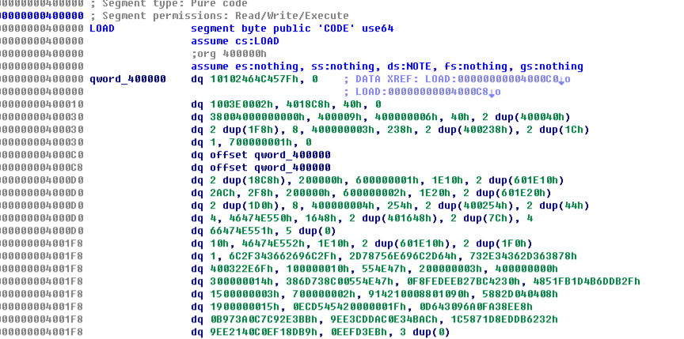
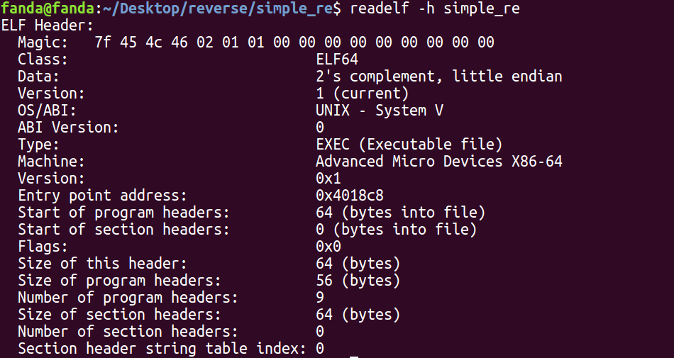
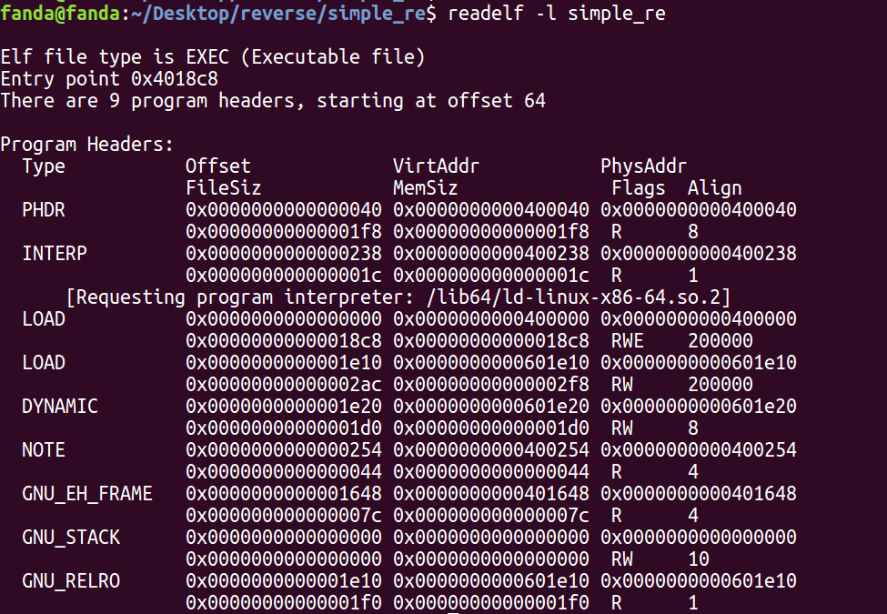
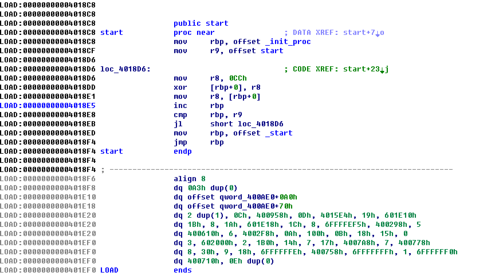
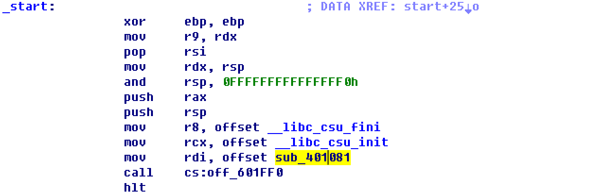
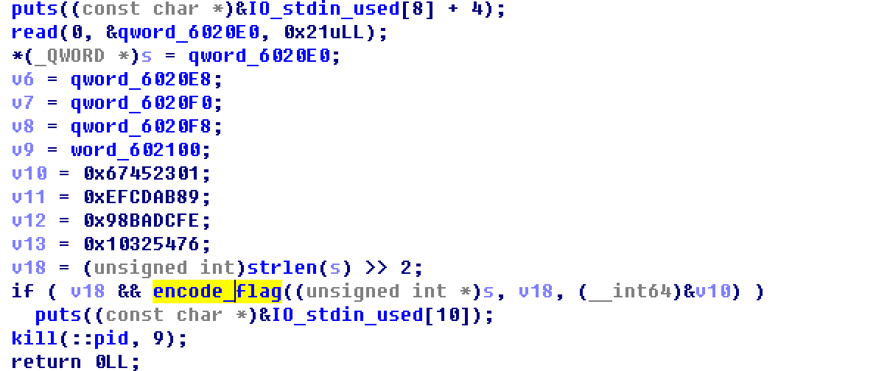
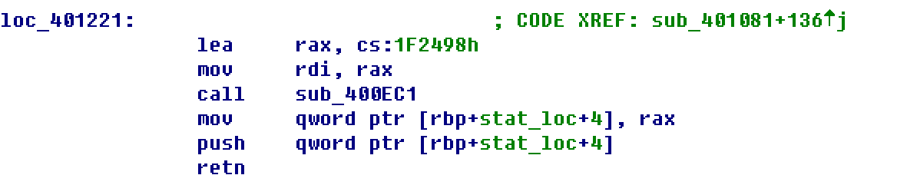
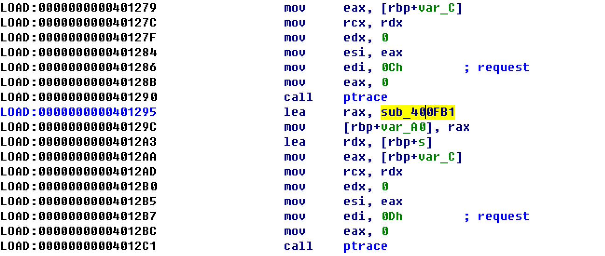

# RCTF2018 simple_re
## Author: fanda
&nbsp;&nbsp;&nbsp;&nbsp;<font size=2>这简直是我有史以来做的最爽的逆向题，综合性很强，各种反调试，还整合了一些密码学，还有爆破的技巧。不过有一个地方我没弄懂。。。为什么IDA并没有给出ELF头的一个错误，而是这些堆在一起的数据：</font></br>



&nbsp;&nbsp;&nbsp;&nbsp;<font size=2>好吧，既然加载错误，那就用readelf -h和-l选项看一下ELF头和程序头吧：</font></br>





&nbsp;&nbsp;&nbsp;&nbsp;<font size=2>可以看到第一个LOAD类型的头里的p_filesz和 p_memsz都只有0x18C8,加载基址是0x4018C8,这个size不够大（虽然我也不知道为什么，我看正常的程序这个size都会比入口大，有人懂的话可以教教我:），所以把这里的两个0x18C8都改成0x2000，用IDA重新加载，好了，可以分析了！然而，事情并不简单：</font></br>



&nbsp;&nbsp;&nbsp;&nbsp;<font size=2>IDA加载到了入口地址0x4018C8,但是这跟往常的入口可不太一样，看来是用了SMC（代码自修改）技术，那这里再介绍一个技术，利用IDA Python脚本辅助逆向分析，我们写一个异或脚本：</font></br>

```python
def xor_decode(start,end,key):
	for p in xrange(start,end):
		PatchByte(p,Byte(p)^key)
```

&nbsp;&nbsp;&nbsp;&nbsp;<font size=2>保存为py文件，用IDA加载这个脚本，然后就可以在IDA下面的python命令行里调用了，分析了SMC代码可知在0x400958到0x400AA0这里的代码都被0xCC逐个字节异或，所以命令行里输入:</font></br>

```python
xor_decode(0x400958,0x4018C8,0xCC)
```

完了之后程序就会跳到start处：



&nbsp;&nbsp;&nbsp;&nbsp;<font size=2>典型的开始，跳到main函数，F5分析一通发现有很多ptrace等常用于反调试的代码，在后面if中看到一个很可疑的函数，上面还有一些类似key table的数据，我们的输入被保存在从0x6020E0开始的地址：</font></br>



&nbsp;&nbsp;&nbsp;&nbsp;<font size=2>跟进函数分析，看到是下面这样的加密：</font></br>

```C
bool __fastcall sub_400B87(unsigned int *a1, signed int a2, __int64 a3)
{
  unsigned int v3; // ST2C_4@3
  unsigned int v4; // ST34_4@5
  int v6; // [sp+28h] [bp-18h]@2
  int v7; // [sp+30h] [bp-10h]@2
  unsigned int v8; // [sp+34h] [bp-Ch]@2
  int i; // [sp+38h] [bp-8h]@1
  unsigned int v10; // [sp+3Ch] [bp-4h]@1

  v10 = 0;
  for ( i = 52 / a2 + 6; i; --i )
  {
    v8 = a1[a2 - 1];
    v7 = 0;
    v10 -= 1640531527;
    v6 = (v10 >> 2) & 3;
    while ( a2 - 1 > v7 )
    {
      v3 = a1[v7 + 1];
      a1[v7] += ((v3 ^ v10) + (v8 ^ *(_DWORD *)(4LL * (v6 ^ v7 & 3u) + a3))) ^ ((4 * v3 ^ (v8 >> 5))
                                                                              + ((v3 >> 3) ^ 16 * v8));
      v8 = a1[v7++];
    }
    a1[a2 - 1] += ((*a1 ^ v10) + (v8 ^ *(_DWORD *)(4LL * (v6 ^ v7 & 3u) + a3))) ^ ((4 * *a1 ^ (v8 >> 5))
                                                                                 + ((*a1 >> 3) ^ 16 * v8));
    v4 = a1[a2 - 1];
  }
  __debugbreak();
  return memcmp(a1, &IO_stdin_used[1], 0x20uLL) == 0;
}
```

&nbsp;&nbsp;&nbsp;&nbsp;<font size=2>呵，这还不简单，分析了一下可以求逆，直接写出求逆代码还原：</font></br>

```C
#include <stdio.h>
#include <string.h>


unsigned char key[33]="quehsj_kcneop_amneuf_ieha_ehdhde";
unsigned int key_gen[13]={0,};
unsigned char flag[33]={0,};
const int len=8;

unsigned int key_arr[]={
  0x67452301,
  0xEFCDAB89,
  0x98BADCFE,
  0x10325476,
  0
};
void init_key()
{
	unsigned int each_gen=0;
	for(int i=0;i<12;i++)
	{
		each_gen-=0x61C88647;
		key_gen[i]=each_gen;
	}
}


void encrypt(unsigned char* key_string,int i)
{
	unsigned int* key_ptr=(unsigned int*)key_string;
	unsigned int cc=(key_gen[i]>>2)&3;
	
	key_ptr[7]-= ((*key_ptr ^ key_gen[i]) + (key_ptr[6] ^ key_arr[cc ^ (7 & 3)])) ^ ((4 * (*key_ptr) ^ (key_ptr[6] >> 5)) + \
								((*key_ptr >> 3) ^ 16 * key_ptr[6]));
	
	for(int j=6;j>=1;--j)
     	key_ptr[j] -= ((key_ptr[j+1] ^ key_gen[i]) + (key_ptr[j-1] ^ key_arr[cc ^ (j & 3)])) ^ ((4 * key_ptr[j+1] ^ (key_ptr[j-1] >> 5))+((key_ptr[j+1] >> 3) ^ 16 * key_ptr[j-1]));
  key_ptr[0]-=((key_ptr[1] ^ key_gen[i]) + (key_ptr[7] ^ key_arr[cc ^ (0 & 3)])) ^ ((4 * key_ptr[1] ^ (key_ptr[7] >> 5)) + ((key_ptr[1] >> 3) ^ 16 * key_ptr[7]));
  
}

int main()
{
	init_key();
	
	int i,j=0;
	unsigned char* key_string;
	char* ptr;
	memcpy(flag,key,32);
	for ( i = 52/len + 6; i; --i )
	{
		encrypt(flag,i-1);
	}
	ptr=(char*)flag;
	printf("%s\n",ptr);
    //结果是：幦鎴謖v}9癞`凣穭ん頄:順黴cQ?F
	
	return 0;
}


```

&nbsp;&nbsp;&nbsp;&nbsp;<font size=2>我？？？？</font></br>
&nbsp;&nbsp;&nbsp;&nbsp;<font size=2>难道我写错逆运算了吗，看了一会儿觉得不对啊，不会有错的啊。用十六进制输出之后跟密文一对照发现一模一样:)</font></br>
&nbsp;&nbsp;&nbsp;&nbsp;<font size=2>OK，看样子被耍了，再看看有没有被遗漏了的其他地方。</font></br>



&nbsp;&nbsp;&nbsp;&nbsp;<font size=2>我们漏了这个函数，其实后面的不会被执行，这个函数用立即数和内存中取出的一个数相加跳转等一些骚操作，最后终于跳到了0x401244,然后注意一下这个函数：</font></br>



&nbsp;&nbsp;&nbsp;&nbsp;<font size=2>跟进之后又是一些跳转，最后到了0x400FDC,在这里发现不能F5，没关系，右键创建为函数，然后就可以了:)</font></br>
&nbsp;&nbsp;&nbsp;&nbsp;<font size=2>分析完了发现又是一个SMC，这次是从0x401482开始的162个字节，再次用python解析一下：</font></br>

```python
xor_decode(0x401482,0x401482+0x162,0x28)
```

&nbsp;&nbsp;&nbsp;&nbsp;<font size=2>来到0x401482这里，重新让IDA分析，然后创建函数，F5了之后是这样的：</font></br>

```C
__int64 __fastcall sub_401482(__int64 flag)
{
  __int64 result; // rax@3
  bool v2; // al@13
  int key2; // [sp+8h] [bp-40h]@1
  int v4; // [sp+Ch] [bp-3Ch]@1
  unsigned int v5; // [sp+10h] [bp-38h]@1
  unsigned int v6; // [sp+14h] [bp-34h]@1
  unsigned int v7; // [sp+18h] [bp-30h]@1
  int v8; // [sp+1Ch] [bp-2Ch]@1
  int key1; // [sp+28h] [bp-20h]@1
  int v10; // [sp+2Ch] [bp-1Ch]@1
  int v11; // [sp+30h] [bp-18h]@1
  unsigned int v12; // [sp+34h] [bp-14h]@1
  int v13; // [sp+38h] [bp-10h]@1
  unsigned int v14; // [sp+3Ch] [bp-Ch]@1
  int xor_sum; // [sp+40h] [bp-8h]@8
  int i; // [sp+44h] [bp-4h]@1

  key1 = 0x556E4969;
  v10 = 0x2E775361;
  v11 = 0x893DAE7;
  v12 = 0x96990423;
  v13 = 0x6CF9D3E9;
  v14 = 0xA505531F;
  key2 = 0x54A0B9BD;
  v4 = 0x4B818640;
  v5 = 0x8EB63387;
  v6 = 0xA9EABEFD;
  v7 = 0xB8CDF96B;
  v8 = 0x113C3052;
  for ( i = 0; i <= 5; ++i )
  {
    if ( *(&key1 + i) * *(_DWORD *)(4 * i + flag) != *(&key2 + i) )
      return 0LL;
  }
  if ( encrypt1(*(_DWORD *)(flag + 24), *(_WORD *)(flag + 28), 0xF64BB17DLL) != 0x6F82C8DC
    || encrypt2(*(_WORD *)(flag + 28), *(_WORD *)(flag + 30)) != 0xA496 )
  {
    result = 0LL;
  }
  else
  {
    xor_sum = 0;
    for ( i = 24; i <= 31; ++i )
      xor_sum ^= *(_BYTE *)(i + flag);
    v2 = xor_sum == 22 && *(_BYTE *)(flag + 32) == 's';
    result = v2;
  }
  return result;
}
```

&nbsp;&nbsp;&nbsp;&nbsp;<font size=2>我已经命名完了，想必这里就是flag的最终藏身之处了。第一个for非常简单，写了一个Z3py脚本，马上就能得到flag的前24个字节：</font></br>

```python
from z3 import *
key=[
  0x556E4969,
  0x2E775361,
  0x893DAE7,
  0x96990423,
  0x6CF9D3E9,
  0xA505531F,
  0x54A0B9BD,
  0x4B818640,
  0x8EB63387,
  0xA9EABEFD,
  0xB8CDF96B,
  0x113C3052]

flag=[]

for i in xrange(6):
  flag.append(BitVec(i,32))

s=Solver()

for i in xrange(6):
  s.add(key[i]*flag[i]==key[i+6])

if s.check()==sat:
  print s.model()

# we got 
# 5o_M@ny_an7i_Rev3rsing_T

```

&nbsp;&nbsp;&nbsp;&nbsp;<font size=2>糟糕的是接下来if里的两个函数，比我想象的要难，分析第一个encrypt1：</font></br>

```C
unsigned __int64 __fastcall encrypt1(unsigned int a1, unsigned int a2, unsigned int a3)
{
  unsigned int v4; // [sp+4h] [bp-18h]@1
  unsigned __int64 v5; // [sp+Ch] [bp-10h]@1
  unsigned __int64 v6; // [sp+14h] [bp-8h]@1

  v4 = a2;
  v6 = 1LL;
  v5 = a1;
  while ( v4 )
  {
    if ( v4 & 1 )
      v6 = v5 * v6 % a3;
    v5 = v5 * v5 % a3;
    v4 >>= 1;
  }
  return v6;
}
```

&nbsp;&nbsp;&nbsp;&nbsp;<font size=2>这个函数根据第二个参数（在这里是flag的第28、29个字节，也就是16个比特）的比特位对第一个参数（在这里是flag的第24、25、26、27个字节，也就是一个DWORD）进行开方，随便举几个例子，你会发现这个函数可以简化为： </font></br>

```C
return a1^a2(mod a3）
```

&nbsp;&nbsp;&nbsp;&nbsp;<font size=2>然后根据返回值和if里的判断，可以这样写：</font></br>

```C
a1^a2==0x6F82C8DC(mod 0xF64BB17D)
//RSA 加密：
//m^e ≡ c (mod n)
```

&nbsp;&nbsp;&nbsp;&nbsp;<font size=2>这就像是RSA加密的形式！所以我们可以根据这个破解出a2这个公钥或者说是私钥吗？不行:)</font></br>
&nbsp;&nbsp;&nbsp;&nbsp;<font size=2>反正我不会，n很小可以轻易的分解出来两个质数，但是我们既不知道公钥也不知道私钥，还是要靠猜，最终又要通过爆破的形式。那我们看出来是RSA有什么用？有用的：</font></br>
&nbsp;&nbsp;&nbsp;&nbsp;<font size=2>如果是模仿了RSA，那么提示就是，a2是一个质数，而且跟模数n一定是互质的，所以可以写这样一段python缩小爆破范围：</font></br>

```python
import math

Euler=4132027200

def Is_Prime(prime):
  if prime%2==0:
    return False
  sqrtnum=int(math.sqrt(prime))
  for i in range(3,sqrtnum+1,2):
    if prime%i==0:
      return False
  return True

def get_prime_arr():
  prime_arr=[]
  for i in range(3,0xffff):
    if(Is_Prime(i)):
      if(prime_with(i,Euler)):
        prime_arr.append(i)
  return prime_arr

def prime_with(num,Euler):
  if Euler%num==0:
    return False
  else:
    return True
```

&nbsp;&nbsp;&nbsp;&nbsp;<font size=2>然后encrypt2函数是这样的：</font></br>

```C
__int64 __fastcall encrypt2(unsigned __int16 a1, unsigned __int16 a2)
{
  unsigned __int16 v2; // ST16_2@2
  unsigned __int16 i; // [sp+0h] [bp-18h]@1
  unsigned __int16 v5; // [sp+4h] [bp-14h]@1

  v5 = a1;
  for ( i = a2; i & v5; i = 2 * (i & v2) )
  {
    v2 = v5;
    v5 ^= i;
  }
  return (unsigned __int16)(i | v5);
}
```

&nbsp;&nbsp;&nbsp;&nbsp;<font size=2>这个我看不出来OTZ，但是可以先用这个跟之前缩小范围得到的质数数组爆破一波，得到与之匹配的另一个数组，这么我们就得到了包含了flag最后四个字节的所有可能的数组：</font></br>

```python
#顺带一提，根据之前的flag，给了一个大写的T，那么猜测T开头的单词，so many
#anti-debug T....会是什么？可能是Technique？根据CTF比赛的尿性，会把个别字母
#替换为数字或者符号，那我们再加上所有可能的符号：
dirt="echnique!13_7|"

def get_word3(word1,word2):
  i=word2
  ptr=word1
  while(i&ptr):
    temp=ptr
    ptr^=i
    i=2*(i&temp)
  return (i|ptr)
  
for i in prime:
  for a in dirt:
    for b in dirt:
      temp=(ord(a)<<8)+(ord(b))
      if(get_word3(i,temp)==0xA496):
        flag3.append(temp)
        real_prime.append(i)
```

&nbsp;&nbsp;&nbsp;&nbsp;<font size=2>这里爆破得到的i就是匹配的最后两个字节的flag的数组的大小了，也就是可能情况的种数，后面的real_prime从原先的素数的数组里重新筛选出真正有用的素数，也就是真正可能的flag的前四个字节。</font></br>

&nbsp;&nbsp;&nbsp;&nbsp;<font size=2>后面还有一个校验最后8个字节xor之后的值是否为22的for循环，根据这个我们还可以进一步缩小爆破范围，所以再加上这一段python：</font></br>

```python
def check2(words,i,flag,real_prime):
  temp=0
  for k in words:
    temp^=k
  temp^=flag[i]
  temp^=real_prime[i]
  one=(temp)>>8
  two=temp&0xff
  return (one^two)
  #当然在这里words是一个双字节数组我把他们拆开来了，
  #后三个参数是下标和缩小范围后的a1和a2
  
flag1=[0,0,0,0,0]
real_flag1=[[]]

for i in range(0,j):
  real_flag1.append([])
  for a in dirt:
    for b in dirt:
      for c in dirt:
        for d in dirt:
          flag1[0]=(ord(a)<<8)+ord(b)
          flag1[1]=(ord(c)<<8)+ord(d)
          if(check2(flag1,i,flag3,real_prime)==22):
            real_flag1[i].append((flag1[0]<<16)+flag1[1])
```

&nbsp;&nbsp;&nbsp;&nbsp;<font size=2>到这里真正可能的情况已经筛选完了，搜集到了若干个数组，这时候我们可以真正开始爆破了:)估计你们也听累了，快得到答案吧。</font></br>
&nbsp;&nbsp;&nbsp;&nbsp;<font size=2>然后我们根据real_prime(也就是最后flag的中间2个字节)用encrypt1函数进行爆破之前筛选出来(xor校验)的根据字典生成的真正有可能的前四个字节的flag组合，一旦成功，此时的下标i对应的匹配过的flag3（flag的最后两位字节）也等于是真正的flag了，嗯，有点绕，这就是最终脚本了：</font></br>

最终脚本：
========

```python
#encoding:utf-8

import math

Euler=4132027200
mod=0xF64BB17D
win=0x6F82C8DC

#dirt='0123456789abcdefghijklmnopqrstuvwxzy!*_'
dirt="echnique!13"

def Is_Prime(prime):
  if prime%2==0:
    return False
  sqrtnum=int(math.sqrt(prime))
  for i in range(3,sqrtnum+1,2):
    if prime%i==0:
      return False
  return True

def get_prime_arr():
  prime_arr=[]
  for i in range(3,0xffff):
    if(Is_Prime(i)):
      if(prime_with(i,Euler)):
        prime_arr.append(i)
  return prime_arr

def prime_with(num,Euler):
  if Euler%num==0:
    return False
  else:
    return True

def check(words,key):
  return words**key%mod

def check2(words,i,flag,real_prime):
  temp=0
  for k in words:
    temp^=k
  temp^=flag[i]
  temp^=real_prime[i]
  one=(temp)>>8
  two=temp&0xff
  return (one^two)


def get_word3(word1,word2):
  i=word2
  ptr=word1
  while(i&ptr):
    temp=ptr
    ptr^=i
    i=2*(i&temp)
  return (i|ptr)


print "Start collect key dirt..."

prime=get_prime_arr()
flag3=[]
real_prime=[]

print "prime dirt collected successfully. Len:%d"%(len(prime))

#j=0
for i in prime:
  for a in dirt:
    for b in dirt:
      temp=(ord(a)<<8)+(ord(b))
      if(get_word3(i,temp)==0xA496):
        flag3.append(temp)
        real_prime.append(i)

print "flag3 dirt collected done. Len:%d"%(len(flag3))
print "The len of real_prime:%d"%(len(real_prime))

j=len(flag3)
flag1=[0,0,0,0,0]
real_flag1=[[]]

for i in range(0,j):
  real_flag1.append([])
  for a in dirt:
    for b in dirt:
      for c in dirt:
        for d in dirt:
          flag1[0]=(ord(a)<<8)+ord(b)
          flag1[1]=(ord(c)<<8)+ord(d)
          if(check2(flag1,i,flag3,real_prime)==22):
            real_flag1[i].append((flag1[0]<<16)+flag1[1])

print "flag1 collected successfully, start to brute..."


k=0
for i in real_flag1:
  print "Brute step:%d len:%d"%(k,len(i))
  for j in i:
    if(check(j,real_prime[k])==win):
      print "Got the flag: %x%x%x"%(j,real_prime[k],flag3[k])
      exit()
  k+=1
#we got 'echnu3!q'
#so the flag is:5o_M@ny_an7i_Rev3rsing_Technu3!q
print "Bruted finished."


```

&nbsp;&nbsp;&nbsp;&nbsp;<font size=2>爆破很快，之前算是没白分析:)就一个字，爽！</font></br>
