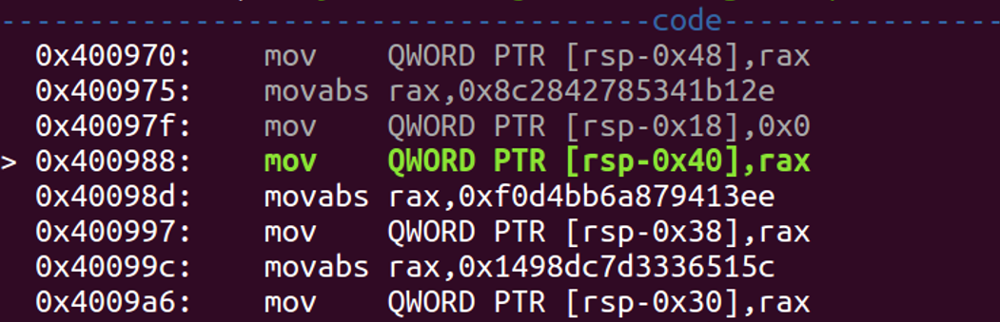

# milktea
## Author: fanda
</br>
&nbsp;&nbsp;&nbsp;&nbsp;<font size=2>其实一开始做这题的时候我是拒绝的，发现 64 位 64 位的分块加密我就知道不太可能 是爆破得到了。这题没想到这么复杂的加密其实是可以求逆的，第一次做的时候太急躁，看到 '&' , '|' 一类的我就放弃了，没想到化简后竟然是可逆的异或，还有 memcmp 这个坑货函数，实际动态调试的时候发现其实其 GOT 表里的地址是要给自定义函数，还对原本的密文进行了异或处理之后才开始对比。 </font></br>


</br>
<font size=2>（跟进到假的 memcmp 函数里面发现的密密密文………… </font></br>
&nbsp;&nbsp;&nbsp;&nbsp;<font size=2>程序的主题还是很清晰的，有几个 key table 用来加密你输入的数据，加密完了跟另一个 flag 的密文比较。 </font></br>
&nbsp;&nbsp;&nbsp;&nbsp;<font size=2>比较复杂的就是还原化简这一大段代码了。  </font></br>

```C
do
    {
      v7 = (((unsigned int)ptr_flag >> 5) | 0xC22DCD39) & (~((unsigned int)ptr_flag >> 5) | 0x3DD232C6);
      v8 = ~(~v7 & 0xA6121C92 | v7 & 0x41EDE36D | 0x5779469B) | (~v7 & 0xA6121C92 | v7 & 0x41EDE36D) & 0x4779469B;
      v9 = (16 * ptr_flag | 0xF7FDFF0C) & (~(16 * ptr_flag) | 0x80200F3);
      v10 = ~(~v9 & 0xDDEA0C3F | v9 & 0x2215F3C0 | 0x6EEC8DD8) | (~v9 & 0xDDEA0C3F | v9 & 0x2215F3C0) & 0x6EEC8DD8;
      v11 = v8 | v10;
      v12 = v10 & v8;
      v13 = (*(_DWORD *)ptr_key + *((_DWORD *)&key_string + (ptr_flag & 0xF))) & 0x6AAB745D | ~((*(_DWORD *)ptr_key
                                                                                               + *((_DWORD *)&key_string
                                                                                                 + (ptr_flag & 0xF))) | 0x6AAB745D);
      v14 = ptr_flag + ((v12 | ~v11 | 0x88421624) & ~((v12 | ~v11) & 0x88421624));
      v15 = ~((v14 | 0xC22DCD39) & (~v14 | 0x3DD232C6));
      h_flag = ((v13 & v15 | ~(v13 | v15) | 0x5779469B) & ~((v13 & v15 | ~(v13 | v15)) & 0x5779469B))
             + (unsigned int)h_flag;
      v16 = *((_DWORD *)ptr_key + 1) + *((_DWORD *)&key_string + (h_flag & 0xF));
      v17 = ((unsigned int)h_flag >> 5) & 0x66EE8D2B | ~(((unsigned int)h_flag >> 5) | 0x66EE8D2B);
      v18 = ~((16 * h_flag | 0xF7FDFF0C) & (~(16 * h_flag) | 0x80200F3));
      v19 = ((v17 & v18 | ~(v17 | v18) | 0x6EEC8DD8) & ~((v17 & v18 | ~(v17 | v18)) & 0x6EEC8DD8)) + h_flag;
      v20 = ~(~((v16 | 0xF7FDFF0C) & (~v16 | 0x80200F3)) & 0xC09AB27B | (v16 | 0xF7FDFF0C) & (~v16 | 0x80200F3) & 0x3F654D84 | 0x6EEC8DD8) | (~((v16 | 0xF7FDFF0C) & (~v16 | 0x80200F3)) & 0xC09AB27B | (v16 | 0xF7FDFF0C) & (~v16 | 0x80200F3) & 0x3F654D84) & 0x6EEC8DD8;
      ptr_key = (char *)ptr_key + 8;
      v21 = ~((v19 | 0xC22DCD39) & (~v19 | 0x3DD232C6)) & 0x632C14AA | (v19 | 0xC22DCD39) & (~v19 | 0x3DD232C6) & 0x9CD3EB55;
      ptr_flag = (((~(v21 | 0x5779469B) | v21 & 0x5779469B | v20) & ~((~(v21 | 0x5779469B) | v21 & 0x5779469B) & v20) | 0xAFF35FA7) & ~((~(v21 | 0x5779469B) | v21 & 0x5779469B | v20) & ~((~(v21 | 0x5779469B) | v21 & 0x5779469B) & v20) & 0xAFF35FA7))
               + (unsigned int)ptr_flag;
    }
    while ( ptr_key != (void *)0x6011A8 );
```

</br>
&nbsp;&nbsp;&nbsp;&nbsp;<font size=2>我不知道这些化简是什么原理，有没有公式可循，反正我耐着性子花了一天多慢慢化简。 </font></br>

```C
//Equal to here:
	
v8=(ptr_flag>>5)^0xccb968cf;
v10=16*ptr_flag^0xbb048114;
v13 = ptr_key1 + *(ptr_string+(ptr_flag & 0xF))^0x95548ba2;
v15 = ptr_flag+ ((ptr_flag>>5)^(ptr_flag<<4))^0x3DD232C6;
h_flag=(ptr_key1 + *(ptr_string+(ptr_flag & 0xF))^ptr_flag+ ((ptr_flag>>5)^(ptr_flag<<4)))+h_flag;
v16=ptr_key2 + *(ptr_string+(h_flag & 0xF));
v17=(h_flag>>5)^(~0x66EE8D2B);
v18=16*h_flag^0x80200F3;
v19=(~v17^v18^0x6EEC8DD8)+ h_flag;
v20=~v16^0xF7FDFF0C^0xC09AB27B^0x6EEC8DD8;
v21 = v19^0xC22DCD39^0x632C14AA;
ptr_flag= (~v21^0x5779469B^v20^0xAFF35FA7)+(unsigned int)ptr_flag;
	
```

</br>
&nbsp;&nbsp;&nbsp;&nbsp;<font size=2>这些临时变量 v 什么 v 什么统统消去，最后就是这两行。 </font></br>

```C
//Then Equal to here:

h_flag=(ptr_key1 + *(ptr_string+(ptr_flag & 0xF))^ptr_flag+ ((ptr_flag>>5)^(ptr_flag<<4)))+h_flag;
ptr_flag= ((((h_flag>>5)^(h_flag<<4))+ h_flag)^(ptr_key2 + *(ptr_string+(h_flag & 0xF))))+ptr_flag;

```

</br>
&nbsp;&nbsp;&nbsp;&nbsp;<font size=2>写出他的解密逆运算：</font></br>

```C
for(int i=0;i<58;i+=2)
{
  cur_key1=key_table[56-i];
  cur_key2=key_table[57-i];
  ptr_flag-=((((h_flag>>5)^(h_flag<<4))+ h_flag)^(cur_key2 + *(ptr_string+(h_flag & 0xF))));
  h_flag-=(cur_key1 + *(ptr_string+(ptr_flag & 0xF))^ptr_flag+ ((ptr_flag>>5)^(ptr_flag<<4)));
}
```

</br>
&nbsp;&nbsp;&nbsp;&nbsp;<font size=2>看上去就是这么简单。 </font></br>
&nbsp;&nbsp;&nbsp;&nbsp;<font size=2>最后用脚本跑一下就能得到flag，源代码我是用 C 写的，就放在下面了： </font></br>

脚本
=====
```C
#include <stdio.h> 
 
char* key_string = "I'm a big fan of septyem46c7eb3f858c137f9bdffa5e0f880e8959bb2e65"; 
 
unsigned __int64 secret_table[]={ 
0x801135aa0bf7ac52,  0x8c2842785341b12e, 
0xf0d4bb6a879413ee,  0x1498dc7d3336515c, 
0x310fe5b80be8ad86,  0x5603371b3deeafd4, 
0 }; 

unsigned __int64 table[]={
0x4ffcd296b19afa37,  0xc912086e763430b7,  
0x9b2b79ee86abc820,   0xa05322e3934cc3ea, 
0xa05322e3934cc3ea,   0xa05322e3934cc3ea, 
0x4aa443cad9cbe242 }; 

unsigned __int64 key[7]={  0, }; 
 
unsigned int key_table[] = {  
0x363DDF8A,  0x0E3707311, 0x0E879FDD,  0x24BEA3C7, 
0x9B7E408B,  0x3074528A,  0x0C6445404, 0x0A35E8A61, 
0x99B3FD42,  0x4DF979E2,  0x1F8C4B0E,  0x1447FFFA, 
0x8B99BBFD,  0x0AF5F33D7, 0x2F51FB8C,  0x0ADC702EB,
0x0B5A5319C, 0x33984815,  0x41535A36,  0x0E657EB0B,
0x0A4B199FF, 0x0D1C6CD38, 0x0BF583A5E, 0x930ABA46, 
0x0D72C79D9, 0x6BFEFE79,  0x0C078D7C2, 0x4E7543D1, 
0x4CD7A6F5,  0x86E471D0,  0x0A3AF0F50, 0x5347B2A8, 
0x32C531A5,  0x6917DC30,  0x47BB052F,  0x0CBF37B13,
0x0D78FCCAA, 0x0B69B15D6, 0x13CE1C8E,  0x38FEA0C8,
0x4B0F668A,  0x680AFFA0,  0x6F6DCF36,  0x4D5B77E0, 
0x0AE297FA2, 0x0F059DF29, 0x4C598EFB,  0x0E006177F,
0x60F2E72D,  0x9060FA96,  0x7B264647,  0x69982847, 
0x0B2722356, 0x586C7009,  0x0A2208796, 0x1DB31180,  
0x0F6CBF07E, 0x8FE301BC, 
0 };

__int64 buf[7]={0,}; 
 
//XOR key table: 
void xor_key_table()
{  
__int64 temp;
  for(int i=0;i<7;i++)  
  {
    temp=(secret_table[i]^table[i]);
    key[i]=temp;   
  }
} 
 
//reverse here: 
__int64 encrypt(__int64 input)
{  
  unsigned int* ptr_string=(unsigned int*)key_string; 
  unsigned int* ptr_key=(unsigned int*)key_table; 
  unsigned int h_flag=(input)>>32; 
  unsigned int ptr_flag=(unsigned int)input;
  __int64 temp=0;
  do  
  {   
    h_flag=(*ptr_key + *(ptr_string+(ptr_flag & 0xF))^ptr_flag+ ((ptr_flag>>5)^(ptr_flag<<4)))+h_flag;
    ptr_flag= ((((h_flag>>5)^(h_flag<<4))+ h_flag)^(*(ptr_key+1) + *(ptr_string+(h_flag & 0xF))))+ptr_flag;
    ptr_key += 2;
  }while(*ptr_key); 
  
  temp=((__int64)ptr_flag<<32)+h_flag;
  printf("0x%I64x\n",temp); 
  return temp; 
} 
 
void decrypt(__int64 key_word,int times)
{  
  unsigned int ptr_flag=key_word>>32; 
  unsigned int h_flag=key_word;  
  unsigned int* ptr_string=(unsigned int*)key_string;  
  unsigned int cur_key1; 
  unsigned int cur_key2; 
  for(int i=0;i<58;i+=2)  
  {   
    cur_key1=key_table[56-i];   
    cur_key2=key_table[57-i];  
    ptr_flag-=((((h_flag>>5)^(h_flag<<4))+ h_flag)^(cur_key2 + *(ptr_string+(h_flag & 0xF))));  
    h_flag-=(cur_key1 + *(ptr_string+(ptr_flag & 0xF))^ptr_flag+ ((ptr_flag>>5)^(ptr_flag<<4)));
  }    
  buf[times]=((__int64)h_flag<<32)+ptr_flag; 
} 
 
int main() 
{  
  //  xor_key_table();   
  for(int i=0;i<7;i++)   
    decrypt(key[i],i);  
  char* ptr=(char*)buf; 
  printf("%s\n",ptr);    
  return 0;  //And we got *ctf{h0w_m4ny_x0r_3qu1v4l3n7_3xpr35510n_y0u_kn0wlol}  :)
}
```
