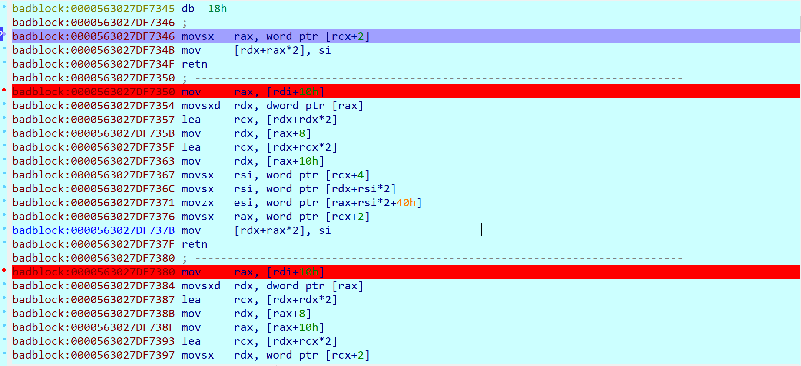

# 鹏城杯badblock
## Author: Wenhuo

&nbsp;&nbsp;&nbsp;&nbsp;<font size=2>这次比赛可以说是很不幸的，因为一个失误没让队友去深圳，太可惜太可惜。</font></br>
&nbsp;&nbsp;&nbsp;&nbsp;<font size=2>其实是非常简单的动态跟踪逆向题，只需要对输入进行不断的下断跟踪就能找到flag的匹配处然后就能还原解密算法了。首先先看看程序的关键部分,数据是我动态调试的时候复制的：</font></br>

**输入(main->sub_2160->sub_2E60->std::cin)**</br>

```
badblock:0000563027DF5F20 mov     [rbp-328h], rax
badblock:0000563027DF5F27 add     rax, 10h
badblock:0000563027DF5F2B mov     [rbp-2C0h], rax
badblock:0000563027DF5F32 call    near ptr unk_563027DF48B0 (<-std::cin)
badblock:0000563027DF5F37 mov     rsi, [rbp-2C0h]
badblock:0000563027DF5F3E lea     r13, [rbp-2A0h]
badblock:0000563027DF5F45 lea     rax, [r13+10h]
```
&nbsp;&nbsp;&nbsp;&nbsp;<font size=2>输入'0123456789abcde'后（注意输入大于等于0x10字节后会被截断，原理未知）。</font></br>
```
00007FFC94587AE0  30 30 30 00 FC 7F 00 00  E0 7B 58 94 FC 7F 00 00  000.............
00007FFC94587AF0  00 7B 58 94 FC 7F 00 00  0F 00 00 00 00 00 00 00  .{X.............
00007FFC94587B00  30 31 32 33 34 35 36 37  38 39 61 62 63 64 65 00  0123456789abcde.
00007FFC94587B10  01 00 00 00 00 00 00 00  00 00 00 00 00 00 00 00  ................
00007FFC94587B20  01 00 00 00 00 00 00 00  58 83 97 11 A4 7F 00 00  ........X.......
00007FFC94587B30  80 7C 58 94 FC 7F 00 00  D0 7A 97 11 A4 7F 00 00  .|X.............
```

&nbsp;&nbsp;&nbsp;&nbsp;<font size=2>可以看到内存中不但由我们的输入还有我们输入的长度，现在对首地址下硬件断点，直接F9运行，到达第一个断点处：</font></br>

```
libc_2.23.so:00007FA410F5E02D ; ---------------------------------------------------------------------------
libc_2.23.so:00007FA410F5E02D mov     [rdi], rsi
libc_2.23.so:00007FA410F5E030 mov     [rdi+rdx-8], rcx
libc_2.23.so:00007FA410F5E035 retn
libc_2.23.so:00007FA410F5E035 ; ---------------------------------------------------------------------------
```
&nbsp;&nbsp;&nbsp;&nbsp;<font size=2>像是调用了库函数完成了一个拷贝，对拷贝的内存处再下一个断点继续跟踪，再次中断后可以看到来到了第一次加密,RSI指向我们的输入字符串：</font></br>

```
badblock:0000563027DF5D68 loc_563027DF5D68:                       ; CODE XREF: badblock:0000563027DF5D7D↓j
badblock:0000563027DF5D68 mov     rcx, [rsi]
badblock:0000563027DF5D6B movzx   r8d, byte ptr [rcx+rdx-1]
badblock:0000563027DF5D71 xor     [rcx+rdx], r8b
badblock:0000563027DF5D75 add     rdx, 1
badblock:0000563027DF5D79 cmp     [rsi+8], rdx
badblock:0000563027DF5D7D ja      short loc_563027DF5D68
badblock:0000563027DF5D7F
```
&nbsp;&nbsp;&nbsp;&nbsp;<font size=2>因为还是读取原来的字符串，所以不用另下断点，直接F9运行后再次断在了同样的位置，四次后才跳出，说明这个加密函数加密了四轮，最终的数据是这样的：</font></br>

```
00007FFC94587AE0  30 30 30 00 FC 7F 00 00  E0 7B 58 94 FC 7F 00 00  000.............
00007FFC94587AF0  00 7B 58 94 FC 7F 00 00  0F 00 00 00 00 00 00 00  .{X.............
00007FFC94587B00  30 31 32 33 34 35 36 37  38 39 61 62 63 64 65 00  0123456789abcde.
00007FFC94587B10  20 7B 58 94 FC 7F 00 00  0F 00 00 00 00 00 00 00   {X.............
00007FFC94587B20  30 31 32 33 04 04 04 04  3C 3D 65 66 5F 59 00 00  0123....<=ef_Y..
00007FFC94587B30  80 7C 58 94 FC 7F 00 00  D0 7A 97 11 A4 7F 00 00  .|X.............
```
&nbsp;&nbsp;&nbsp;&nbsp;<font size=2>由此我们可以得到加密算法与之的逆运算：</font></br>

```python
#encrypt
'''
for i in range(4):
    for j in range(1,len(recorver)):
        recorver[j]^=recorver[j-1]
'''
#decrypt
for i in range(4):
    for j in range(len(recorver)-1,0,-1):
        recorver[j]^=recorver[j-1]

```

&nbsp;&nbsp;&nbsp;&nbsp;<font size=2>继续运行程序断在了此处：</font></br>

```
badblock:0000563027DF5DBB ; ---------------------------------------------------------------------------
badblock:0000563027DF5DBB
badblock:0000563027DF5DBB loc_563027DF5DBB:                       ; CODE XREF: badblock:0000563027DF5D96↑j
badblock:0000563027DF5DBB mov     r9, [rsi+10h]
badblock:0000563027DF5DBF mov     r10, [rsi+18h]
badblock:0000563027DF5DC3 mov     [rax+10h], r9
badblock:0000563027DF5DC7 mov     [rax+18h], r10
badblock:0000563027DF5DCB jmp     short loc_563027DF5DA3
badblock:0000563027DF5DCB ; ---------------------------------------------------------------------------
```

&nbsp;&nbsp;&nbsp;&nbsp;<font size=2>看上去又是一次拷贝，在拷贝处下断，继续运行两次后可以看到：</font></br>

```
badblock:0000563027DF5E10 ; ---------------------------------------------------------------------------
badblock:0000563027DF5E10
badblock:0000563027DF5E10 loc_563027DF5E10:                       ; CODE XREF: badblock:0000563027DF5E2B↓j
badblock:0000563027DF5E10 movsx   cx, byte ptr [r8+rdx]
badblock:0000563027DF5E16 mov     [rax+rdx*2+18h], cx
badblock:0000563027DF5E1B movzx   ecx, word ptr [rdi+rdx*2]
badblock:0000563027DF5E1F mov     [rax+rdx*2+40h], cx
badblock:0000563027DF5E24 add     rdx, 1
badblock:0000563027DF5E28 cmp     rsi, rdx
badblock:0000563027DF5E2B jnz     short loc_563027DF5E10
badblock:0000563027DF5E2D lea     rsi, unk_563027FF9020
badblock:0000563027DF5E34 mov     [rbx+10h], rax
badblock:0000563027DF5E38 mov     rdi, rbx
badblock:0000563027DF5E3B mov     [rax+8], rsi
badblock:0000563027DF5E3F lea     rsi, unk_563027FF9340
badblock:0000563027DF5E46 mov     [rax+10h], rsi
badblock:0000563027DF5E4A mov     rax, [rbx]
badblock:0000563027DF5E4D call    qword ptr [rax+68h]
badblock:0000563027DF5E50 cmp     eax, 1
badblock:0000563027DF5E53 setz    al
badblock:0000563027DF5E56 add     rsp, 8
badblock:0000563027DF5E5A movzx   eax, al
badblock:0000563027DF5E5D pop     rbx
badblock:0000563027DF5E5E pop     rbp
badblock:0000563027DF5E5F retn
```

&nbsp;&nbsp;&nbsp;&nbsp;<font size=2>暂且不去管这一次拷贝的目的，但可以猜到我们要解密的密文也同样被放在了相邻的缓冲区里，我们在新的拷贝处下断点后继续运行。</font></br>

```
0000563029E03510  00 00 00 00 00 00 00 00  30 00 31 00 32 00 33 00  ........0.1.2.3.
0000563029E03520  04 00 04 00 04 00 04 00  3C 00 3D 00 65 00 66 00  ........<.=.e.f.
0000563029E03530  5F 00 59 00 00 00 00 00  00 00 00 00 00 00 00 00  _.Y.............
0000563029E03540  2E 00 26 00 2D 00 29 00  4D 00 67 00 05 00 44 00  ..&.-.).M.g...D.
0000563029E03550  1A 00 0E 00 7F 00 7F 00  7D 00 65 00 77 00 00 00  ........}.e.w...
```

**断在这里**
```
badblock:0000563027DF7346 ; ---------------------------------------------------------------------------
badblock:0000563027DF7346 movsx   rax, word ptr [rcx+2]
badblock:0000563027DF734B mov     [rdx+rax*2], si
badblock:0000563027DF734F retn
badblock:0000563027DF734F ; ---------------------------------------------------------------------------
```
&nbsp;&nbsp;&nbsp;&nbsp;<font size=2>这里就是第二次加密了，实现了一个状态机对输入进行逐个异或后与密文对比判断正确，跟踪就可以得到加密逻辑，像这样下断就行了：</font></br>



&nbsp;&nbsp;&nbsp;&nbsp;<font size=2>最后我们得到了第二轮的加密逻辑后就可以开始解密了，程序的加解密算法如下：</font></br>

```python
#encoding:utf-8
import binascii

#inputs='0123456789abcde'
result=[]

'''
flag='2E 00 26 00 2D 00 29 00  4D 00 67 00 05 00 44 00\
      1A 00 0E 00 7F 00 7F 00  7D 00 65 00 77 00 24 00\
      1A 00 5D 00 33 00 51 00  00 00 00 00 00 00 00 00'
'''

flag='2E262D294D6705441A0E7F7F7D6577241A5D3351'

Flag=''

recorver=[]
for i in binascii.a2b_hex(flag):
    recorver.append(ord(i))

n=0x48
for i in range(len(recorver)):
    recorver[i]^=n
    n+=2

# encrypt:
'''
for i in range(4):
    for j in range(1,len(recorver)):
        recorver[j]^=recorver[j-1]
'''
# decrypt:
for i in range(4):
    for j in range(len(recorver)-1,0,-1):
        recorver[j]^=recorver[j-1]

print ''.join(map(chr,recorver))

#flag{Y0u_ar3_S0co0L}

```
